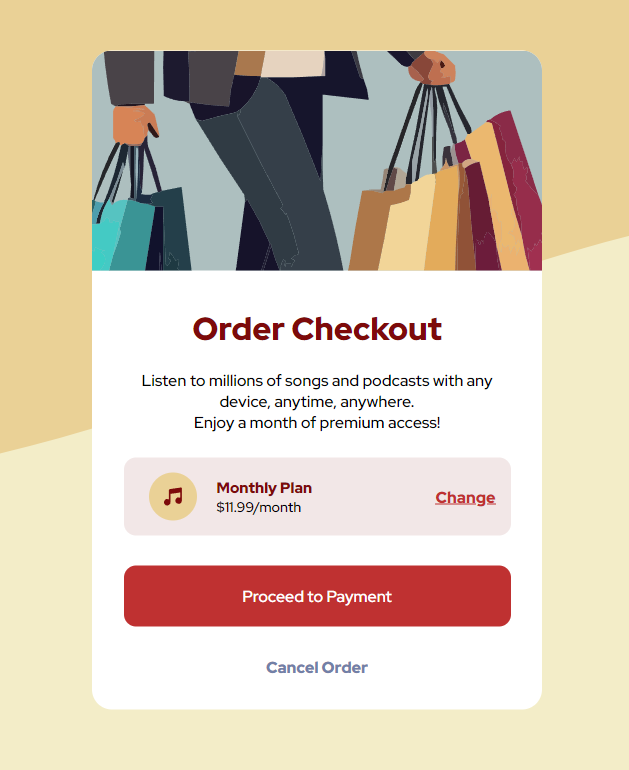

  <h1> HTML/CSS Checkout Component </h1>
    
  
Live Site: (https://checkout-component-delta.vercel.app/)

<h1>Table of Contents</h1>

<ul>
  <li>Component</li>
  <li>Overview</li>
  <li>Usage</li>
</ul>

# Component

    
     

# Overview

    

    The goal was to create a Order Checkout summary component that would be used on the Order Confirmation page. I used HTML to create the structure of the component and CSS to style the component. The component contained hover effects, a responsive layout, and a mobile layout design in Widths 375px and 1440px.
    

# Usage

  

  This component can be used on many different pages. Any application that needs to display the order summary, total price, and a button to proceed to the payment page could take advantage of this component.
  

